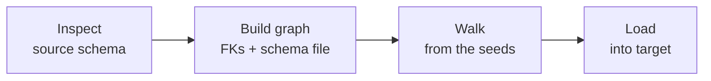
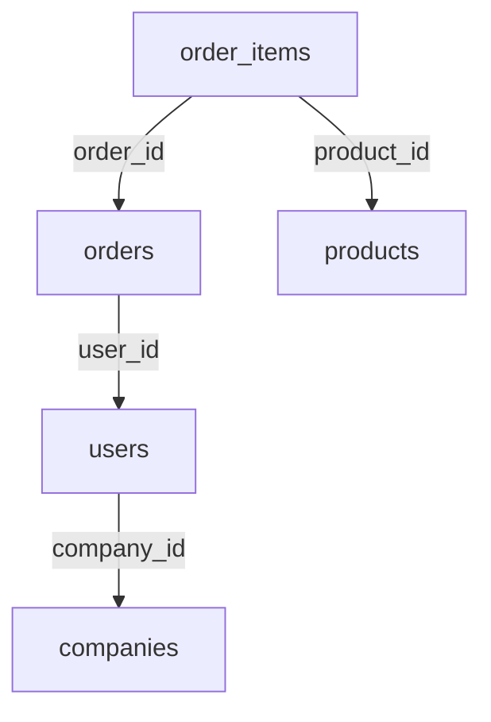

This page explains the ideas behind Tributary: seeds, the relationship graph, traversal, and cycles. Read it to predict what a `plan` will include.

## The pipeline

Every `plan` and `sync` runs the same four stages. `plan` stops after the third stage.



1. **Inspect.** Tributary reads every table, column, primary key, foreign key, and enum type from the source. It skips the system schemas (`pg_catalog`, `information_schema`, `pg_toast`) and its own `_tributary` schema.
2. **Build the graph.** Each table is a node. Each foreign key is an edge from the child table to the parent table. Relationships from your [schema file](/schema-configuration) are added as extra edges, and `ignore` entries remove edges.
3. **Walk.** Starting from the seed rows, Tributary follows edges and collects rows, breadth first. The result is the **subset**.
4. **Load.** Tributary creates missing target tables, then upserts each table's rows in dependency order. See [Re-runs and resume](/reruns-and-resume).

The whole walk runs inside one read-only, repeatable-read transaction on the source. Every query sees the same snapshot, so the subset is consistent even while production keeps changing.

## Seeds

A **seed** is a table plus a SQL `WHERE` fragment. Every row the fragment matches becomes a starting point.

```bash
-t users -w "email = 'admin@example.com'"
```

- Bare table names resolve to the schema file's `defaultSchema`, which is `public` unless you change it or have no schema file. Use `schema.table` for anything else.
- You can pass several seeds. Repeat the `-t`/`-w` pair.
- The fragment is raw SQL, so you can use anything a `WHERE` clause allows: `created_at > now() - interval '1 day'`, `id IN (1, 2, 3)`, or `true` for every row.
- Every seed table needs a primary key. Tributary uses primary keys to identify rows.

## Parents and children

Take a foreign key `orders.user_id -> users.id`. From the point of view of an `orders` row, the `users` row is its **parent**. From the point of view of the `users` row, each `orders` row is a **child**.

Tributary treats the two directions differently:

| Direction | Why it is followed | When it is followed |
| --- | --- | --- |
| Row to its **parents** | Without them, the row's foreign keys can't be satisfied on the target. | Always, for every row. |
| Row to its **children** | They are the data that "belongs to" the row. | Depends on the traversal mode. |

A `NULL` foreign key has no parent to follow, so it is skipped.

## Traversal modes

The `--traversal` flag decides which rows fan out to their children.

### `downstream` (default)

Only **downstream** rows fan out to their children. A row is downstream if it is a seed, or if it was reached as a child of another downstream row.

A row pulled in *only* to satisfy a foreign key is a **required parent**. It is copied, and its own parents are copied too, but its other children are not.

Consider this schema, seeded with one user:



| Table | Included? | Why |
| --- | --- | --- |
| `users` (the seed) | Yes | Seed |
| `orders` of that user | Yes | Children of a downstream row |
| `order_items` of those orders | Yes | Children of a downstream row |
| `products` those items reference | Yes | Required parents |
| The user's `companies` row | Yes | Required parent |
| Other users of the same company | **No** | The company is only a required parent, so it doesn't fan out |
| Other order items of the same products | **No** | Products are only required parents |

This keeps the subset focused. Without the rule, one shared row, such as a company or a country, would pull in most of the database.

<Note>
  If a row is first reached as a required parent and later reached downstream, Tributary expands it again so its children are included.
</Note>

### `full`

Every row fans out to its children, including required parents.

```bash
tributary plan -t users -w "id = 42" --traversal full --source prod
```

In the example above, `full` would also pull in every other user of the company, their orders, and so on. Use it when you really want everything connected to the seed, and always check the `plan` first.

<Warning>
  `--traversal full` can grow very quickly on a well-connected schema. Run `plan` before `sync` to see the row counts.
</Warning>

## Relationships Tributary follows

Tributary combines three kinds of edges:

| Edge | Where it comes from |
| --- | --- |
| Foreign key | A real `FOREIGN KEY` constraint in the source database. Followed automatically. |
| Declared reference | A `references` entry in your schema file, for relationships the database doesn't enforce. Can be composite. |
| Polymorphic reference | A `polymorphic` entry in your schema file. The target table depends on a discriminator column, such as Rails' `subject_type`. |

You can also tell Tributary *not* to follow a real foreign key with `ignore`. See [Schema file](/schema-configuration).

## Cycles

Some schemas contain foreign key cycles:

- A **self-reference**, such as `employees.manager_id -> employees.id`.
- A **multi-table cycle**, such as `teams.lead_id -> users.id` with `users.team_id -> teams.id`.

Following a cycle without limits can climb a whole hierarchy. Tributary **breaks** cyclic edges so the walk ends:

1. A broken edge stops being followed for the rest of the walk.
2. During the load, the broken column is written as `NULL` first.
3. After every table is loaded, Tributary **backfills** the column where the referenced row is in the subset. Where it isn't, the column stays `NULL`.

You control which edge breaks:

- **Declare it.** Add the column to `breakCycle` in your schema file. The plan shows `(breakCycle applied)`.
- **Let Tributary choose.** Without a declaration, Tributary breaks the first cyclic edge it meets. The plan shows `(cycle auto-broken; ...)` and suggests adding a `breakCycle` entry.
- **Require declarations.** With `--strict-cycles`, an undeclared cycle is an error instead of an automatic break. This is useful in CI.

<Warning>
  A broken column must be nullable. If a self-reference or broken cycle column is `NOT NULL`, Tributary stops before loading and names the column.
</Warning>

## Reading a plan

```text
┌──────────────────┬──────┬────────────────────────────────────────────────────────────────────┐
│ table            │ rows │ via                                                                │
├──────────────────┼──────┼────────────────────────────────────────────────────────────────────┤
│ public.comments  │ 2    │ seed                                                               │
│ public.employees │ 4    │ public.posts.author_id -> public.employees.id (breakCycle applied) │
│ public.posts     │ 1    │ public.comments.subject_type -> public.posts (polymorphic: Post)   │
└──────────────────┴──────┴────────────────────────────────────────────────────────────────────┘

total: 7 rows across 3 tables
```

This plan was seeded with two comments. The comments point at a post through a polymorphic reference, and the post's author is an employee whose `manager_id` self-reference is cut with `breakCycle`.

- **table** lists tables in load order: parents before children, based on real foreign keys. Ties are sorted alphabetically.
- **rows** is how many rows of that table are in the subset.
- **via** is one edge by which the table was reached, or `seed`.
- Warnings appear below the table, for example an unknown polymorphic type value.

Add `--json` to get the same data as JSON. See the [CLI reference](/cli-reference#plan).
