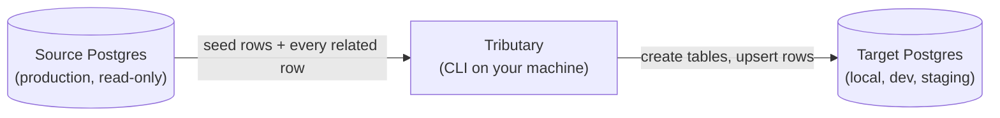

Tributary copies a **referentially consistent subset** of a Postgres database into another database.

You pick one or more seed rows, for example "the user with this email". Tributary follows real foreign keys, plus any relationships you declare, and collects every row that has to travel with those seeds. It then loads that subset into a target database. It creates missing tables on the way and upserts rows when you run it again.



## Why Tributary?

Copying a whole production database to your laptop is slow, expensive, and often not allowed. Copying a handful of rows by hand breaks foreign keys and leaves you with a database your app can't use.

Tributary sits in between. You say which rows you care about, and it works out the rest: the orders that belong to that user, the products those orders reference, the company the user belongs to, and so on. The result is small, but every reference inside it resolves.

Typical uses:

- Reproduce a customer's bug locally with exactly that customer's data.
- Seed a development or staging database with realistic, connected data.
- Build a small fixture database for integration tests.

## Key features

<CardGroup cols={2}>
  <Card title="Referential integrity" icon="link">
    Follows foreign keys in both directions, so every row in the subset has the parents it needs.
  </Card>

  <Card title="App-level relations" icon="diagram-project">
    Declare relationships your database doesn't enforce, including composite and polymorphic ones, in a schema file.
  </Card>

  <Card title="Safe to re-run" icon="arrows-rotate">
    Rows already on the target are updated to match the source. Nothing is duplicated.
  </Card>

  <Card title="Resumable" icon="rotate-right">
    Each table commits with a checkpoint, so an interrupted sync continues where it stopped.
  </Card>

  <Card title="Schema auto-create" icon="database">
    Missing target tables are created with the source's exact column types, keys, and enums.
  </Card>

  <Card title="Production-safe reads" icon="shield-halved">
    Every source query runs in a read-only transaction. Writes only go to allowlisted hosts.
  </Card>

  <Card title="Plain-language mode" icon="wand-magic-sparkles">
    Describe what you want, and `tributary ai` builds the command for you to review.
  </Card>

  <Card title="Library included" icon="code">
    Use the same engine from TypeScript with `@bhuneshvar-k/tributary-core`.
  </Card>
</CardGroup>

## How it works in one minute

<Steps>
  <Step title="Inspect">
    Tributary reads the source schema: tables, columns, primary keys, foreign keys, and enum types.
  </Step>
  <Step title="Build the graph">
    It merges the database's foreign keys with the relationships in your schema file into one graph of tables.
  </Step>
  <Step title="Walk from the seeds">
    Starting at your seed rows, it follows the graph to collect every row that must come along.
  </Step>
  <Step title="Load">
    It creates any missing tables on the target and upserts rows table by table, parents before children.
  </Step>
</Steps>

Read [How Tributary works](/how-it-works) for the details.

## A quick taste

```bash
# Preview: how many rows would travel with this user? Writes nothing.
tributary plan -t users -w "email = 'admin@example.com'" --source prod

# Copy them into your local database.
tributary sync -t users -w "email = 'admin@example.com'" --source prod --target local
```

## Next steps

<CardGroup cols={2}>
  <Card title="Install Tributary" icon="download" href="/installation">
    Install the CLI with npm.
  </Card>

  <Card title="Quickstart" icon="rocket" href="/quickstart">
    Copy your first subset in five minutes.
  </Card>

  <Card title="Schema file" icon="file-code" href="/schema-configuration">
    Teach Tributary about relationships your database doesn't declare.
  </Card>

  <Card title="CLI reference" icon="terminal" href="/cli-reference">
    Every command and flag.
  </Card>
</CardGroup>
