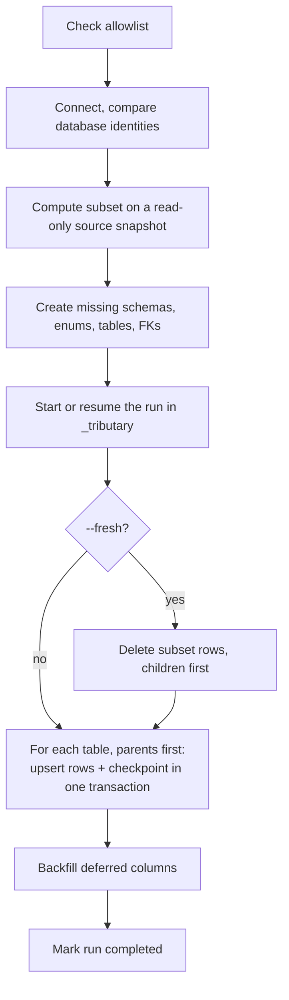

This page explains exactly what `tributary sync` does to the target database, and what happens when you run it again or it gets interrupted.

## What a sync does



## Re-runs upsert

Rows are written with `INSERT ... ON CONFLICT (primary key) DO UPDATE`. Running the same sync twice is safe:

- A row that isn't on the target yet is **inserted**.
- A row that's already on the target is **updated** to match the source.
- Rows on the target that aren't in the subset are **not touched**.

This makes `sync` a good way to refresh local data: run it again whenever you want the latest source values.

<Note>
  Upserts match on the primary key only. If a target row conflicts on another unique constraint, the load fails with a `unique violation` error. See [Troubleshooting](/troubleshooting#unique-violation).
</Note>

## Start clean with `--fresh`

```bash
tributary sync -t users -w "id = 42" --source prod --target local --fresh
```

`--fresh` does two things:

1. **Deletes the subset's rows** from the target before loading, children before parents, by primary key. Only those exact rows are deleted. Tributary never runs `TRUNCATE` or deletes anything outside the subset.
2. **Ignores earlier checkpoints**, so every table is loaded again instead of resumed.

Use it when target rows have drifted, for example after local edits, and you want them reset to the source.

## Resume after an interruption

Each table is loaded in its own transaction, and its checkpoint is saved in the **same** transaction. A table is either fully loaded and checkpointed, or not loaded at all.

If a sync fails or is interrupted, run the same command again. Tributary:

1. Recognizes it as the same run.
2. Skips tables that were already loaded, shown as `already loaded (resumed)`.
3. Continues with the remaining tables.

### What counts as the same run

The **run ID** is a hash of:

- The source's host, port, and database name
- The seeds (tables and `WHERE` fragments)
- The schema file's relations and cycle breaks
- `--traversal` and `--strict-cycles`

Change any of these and it's a new run. The run ID is printed at the end of every sync: `(run 3f9a1c0d2b7e4a61)`.

### Changed source data is never skipped

Each checkpoint stores a **fingerprint** of the rows that table received. On resume, a table is only skipped if the rows it would receive now have the same fingerprint. If the source rows changed since the interrupted run, the table is loaded again.

### After a successful run

When a run completes, its checkpoints are cleared the next time it starts. Running a completed sync again reloads every table, which is what you want for a refresh.

### Where checkpoints live

Checkpoints live in the **target** database, in a schema called `_tributary`. This means a resume works from any machine, and checkpoints commit atomically with the data.

| Table | Contents |
| --- | --- |
| `_tributary.runs` | One row per run: `run_id`, `status` (`in_progress`, `completed`, `failed`), `failure_reason`, timestamps. |
| `_tributary.run_tables` | One row per loaded table: `run_id`, `table_name`, `rows_fingerprint`, `rows_upserted`, `completed_at`. |

To see why the last run failed:

```sql
SELECT run_id, status, failure_reason, created_at
FROM _tributary.runs
ORDER BY created_at DESC
LIMIT 5;
```

You can drop the `_tributary` schema at any time. You only lose the ability to resume interrupted runs. Tributary hides this schema from `inspect`, so it is never copied.

## Schema auto-create

Before loading, Tributary checks that every table in the subset exists on the target.

### Missing tables are created

A missing table is created from the source definition, in one transaction:

| Copied | Not copied |
| --- | --- |
| Schemas (namespaces) | Column defaults |
| Columns with their exact types, such as `numeric(12,4)` or `billing.status[]` | Sequences and identity columns |
| `NOT NULL` | `CHECK` constraints |
| Primary keys | Indexes other than the primary key |
| Foreign keys, when the referenced table exists on the target | Unique constraints other than the primary key |
| Enum types, in their own schemas, including enums only used in arrays | Triggers, views, functions |
| | Domains, composite types, and range types |

Foreign keys are added after all missing tables exist, so cyclic constraints work. A foreign key to a table outside the subset that also doesn't exist on the target is skipped with a warning.

<Warning>
  Columns that use a domain, composite, or range type need that type to exist on the target already. Tributary only auto-creates enums, and fails with a clear error otherwise.
</Warning>

<Tip>
  Auto-created tables are good enough to hold the data, but they lack defaults, sequences, and indexes. For a target your app will run against, create the schema with your app's migrations first, then let Tributary fill it.
</Tip>

### Existing tables are checked, not altered

If a table already exists on the target, Tributary never alters it. It checks that:

- Every source column exists on the target. Extra target-only columns are fine.
- No column that's nullable in the source is `NOT NULL` on the target.

If a check fails, the sync stops before writing any rows.

### Turn creation off

```bash
tributary sync ... --no-create-schema
```

With `--no-create-schema`, a missing table is an error that lists every missing table. Use it when the target's schema must come only from your migrations.

## Load order and deferred columns

Tables are loaded parents first, based on the real foreign keys in the source. Ties are broken alphabetically, so the order is stable.

Some foreign key columns can't be satisfied row by row:

- Self-references, such as `employees.manager_id`
- Columns of a broken cycle (`breakCycle` or auto-broken)
- Real foreign keys you marked with `ignore`

These columns are **deferred**: loaded as `NULL` first, then **backfilled** in one final transaction after every table is loaded. A value is restored only if the referenced row is in the subset. Otherwise it stays `NULL`. The sync output shows this per table:

| Column | Meaning |
| --- | --- |
| **upserted** | Rows inserted or updated |
| **backfilled** | Rows whose deferred columns were restored |
| **left null** | Rows whose referenced row is outside the subset, so the column stays `NULL` |

## Exact values

Values travel as Postgres's own text representation and are parsed by the target. Timestamps keep their microseconds, numerics and bigints keep their precision, and JSON, arrays, and `bytea` arrive unchanged.

Rows are written in batches of up to 1,000 rows, staying under Postgres's parameter limit.
