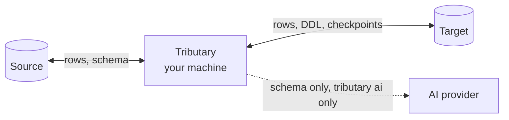

Tributary is built to point at production. This page covers what it does to keep the source untouched, keep writes on the right database, and keep your data on your own machines.

## The source is never written

Every query against the source runs inside a `READ ONLY`, `REPEATABLE READ` transaction. This applies to `plan`, `sync`, `inspect`, `schema init`, `schema validate --source`, and the schema read in `tributary ai`.

- **Read only.** Postgres itself rejects any write inside the transaction.
- **Repeatable read.** Every query sees the same snapshot, so the subset is consistent even while production changes.

### Seed predicates are a single statement

Your `--where` fragment is raw SQL. Tributary sends the seed query using Postgres's extended protocol, which accepts exactly one statement. A fragment that tries to escape the transaction, such as:

```sql
id = 1; COMMIT; DELETE FROM users
```

is rejected by Postgres instead of run.

<Tip>
  Use a read-only database role for your source connection anyway. It protects you even if something else goes wrong.
</Tip>

## Writes need an allowlist

`sync` refuses to write to a target whose host isn't on your allowlist.

```bash
tributary config set allowlist 'localhost,*.staging.internal'
```

| Entry | Matches |
| --- | --- |
| `localhost` | Exactly `localhost` |
| `db.dev.internal` | Exactly that host |
| `*.staging.internal` | Any subdomain at any depth, such as `pg.staging.internal` or `a.b.staging.internal` |
| `/var/run/postgresql` | A Unix socket directory |

- Matching is case-insensitive.
- A connection string with no host counts as `localhost`.
- **An empty allowlist denies every target.** Each machine must opt in explicitly.

A blocked sync fails before it connects:

```text
error: refusing to write: target host "prod-db" is not in the target allowlist (an empty allowlist denies every target)
```

## A database can't be synced into itself

Before loading, Tributary compares the identity of the source and target databases. It refuses to continue if they match:

- **Instance identity.** Server start time, database OID, and database name. Any role can read these, and they don't depend on the network path. A connection through PgBouncer and a direct connection to the same database still match.
- **Cluster identity.** The cluster's system identifier plus database name, when the role may read `pg_control_system()`. This catches a streaming replica of the target.

```text
error: refusing to sync: source and target are the same database
```

## What gets written to the target

On the target, Tributary only:

- Creates missing schemas, enum types, tables, and foreign key constraints. See [Re-runs and resume](/reruns-and-resume#schema-auto-create).
- Inserts or updates the subset's rows, keyed by primary key.
- With `--fresh`, deletes exactly the subset's rows by primary key. It never runs `TRUNCATE`.
- Keeps checkpoints in its own `_tributary` schema.

Rows on the target that aren't in the subset are never touched.

## Plain-language mode asks first

`tributary ai` shows the command it generated and asks for confirmation before any `sync`. The default answer is **no**. Pass `--yes` to skip the prompt, or `--dry-run` to only print the command. When there's no terminal to ask, such as in CI, the sync is refused unless you pass `--yes`.

`tributary schema init` also asks before overwriting an existing file, and refuses without a terminal unless you pass `--force`.

## Where your data goes

Tributary runs on your machine and connects directly to your source and target databases.



| Data | Where it goes |
| --- | --- |
| Row data | From source to target, through your machine's memory. Never written to local disk and never sent anywhere else. |
| Checkpoints | The target's `_tributary` schema. They hold run IDs, table names, row counts, and fingerprints (hashes), not row values. |
| Connection strings and API keys | Your local config file. See below. |
| Schema metadata | Sent to your AI provider **only** when you run `tributary ai`. |

Tributary has no telemetry and makes no other network connections.

### What `tributary ai` sends

To generate a command, `tributary ai` sends your request plus a description of the source schema to the AI provider you configured:

- Schema-qualified table names and primary keys
- Column names, types, and nullability
- Foreign keys
- Enum type names and their labels

It never sends row data or connection strings. If your schema itself is sensitive, don't use `tributary ai`, or point it at a provider you trust, such as a self-hosted endpoint with the `opencode` provider. See [Tributary AI](/tributary-ai).

## Your local config file holds secrets

Connection strings and API keys are stored in **plaintext** JSON, by default at `~/.config/tributary/config.json`.

- On macOS and Linux, Tributary keeps the directory at mode `0700` and the file at `0600`, so only your user can read them. It tightens the permissions of older, looser files when it opens them.
- `tributary config list` prints every value, secrets included, unmasked.

<Warning>
  Keep the config file off shared machines and out of backups you don't control. Don't paste the output of `tributary config list` into tickets or chat.
</Warning>

## Safety checklist

- [ ] The source connection uses a read-only role.
- [ ] The allowlist only contains hosts you're happy to write to.
- [ ] You ran `plan` before the first `sync` of a new seed.
- [ ] Remote connections use TLS, for example `?sslmode=require` in the URL.
- [ ] The config file isn't on a shared machine.

## Open source

Tributary is open source under the MIT License. You can read exactly what it does at [github.com/bhuneshvar-k/tributary](https://github.com/bhuneshvar-k/tributary).
